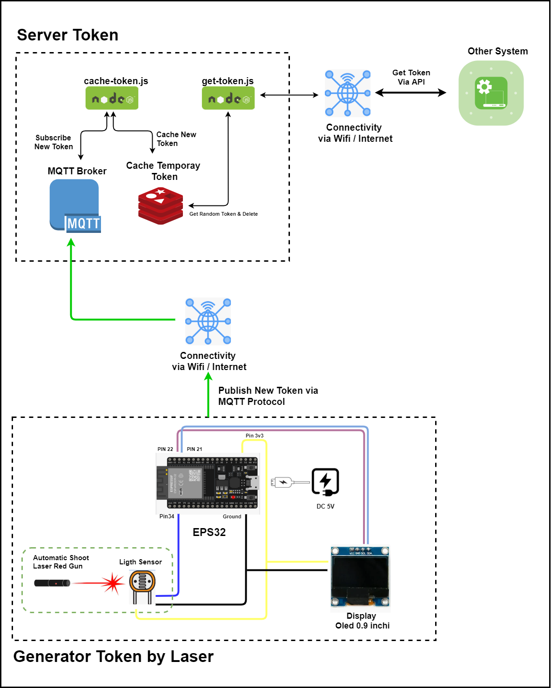
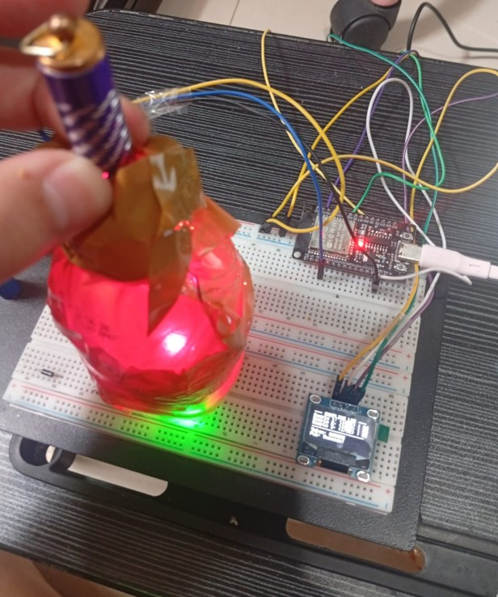
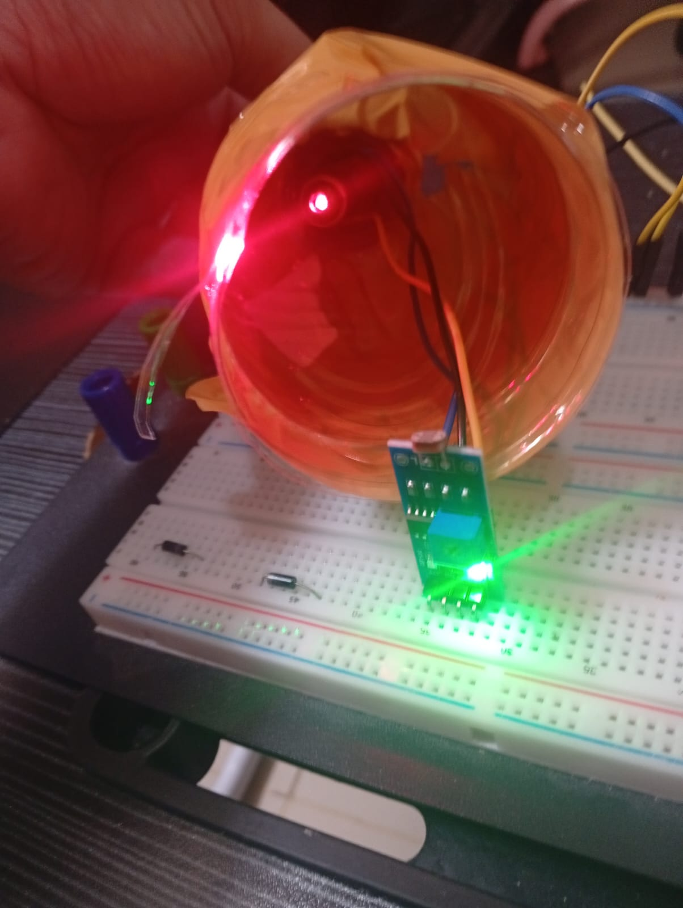
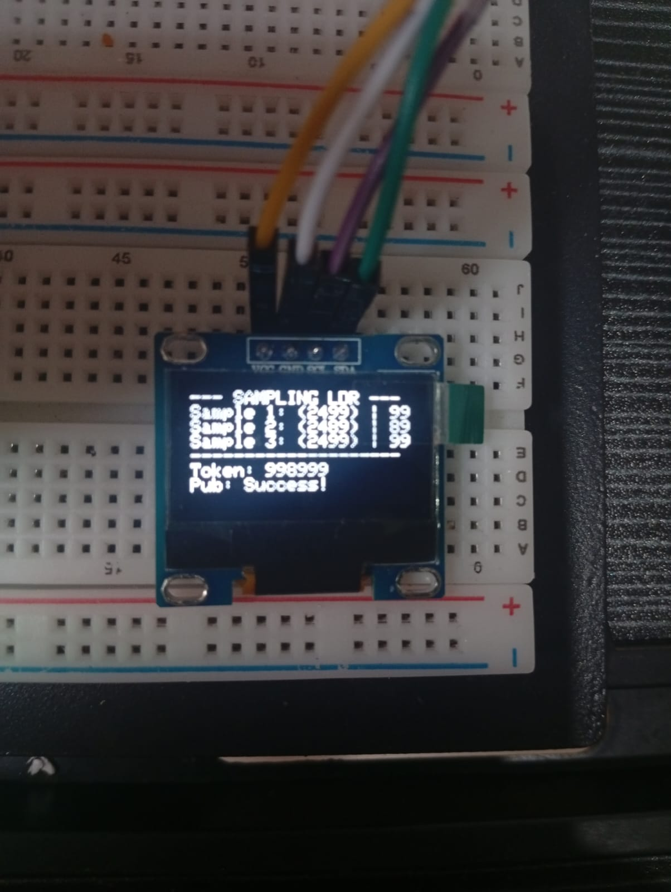
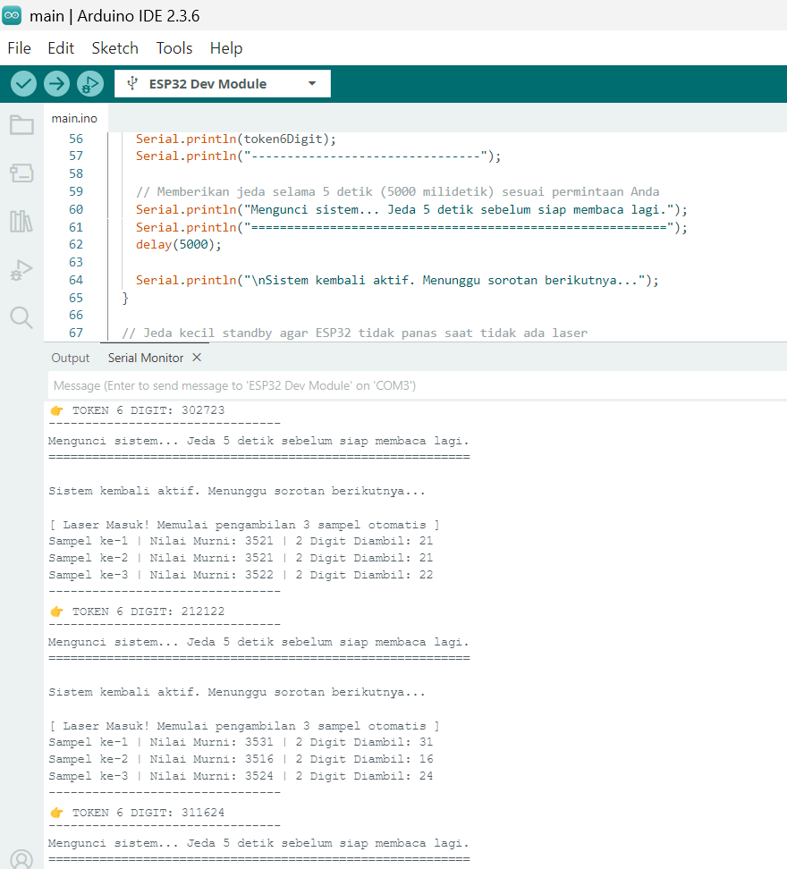
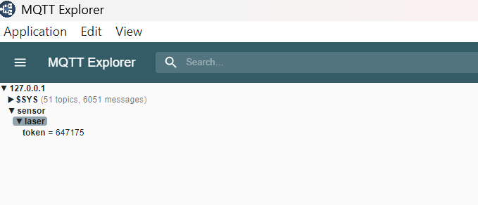
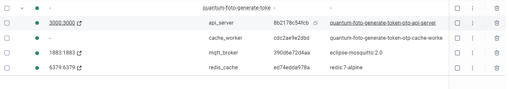
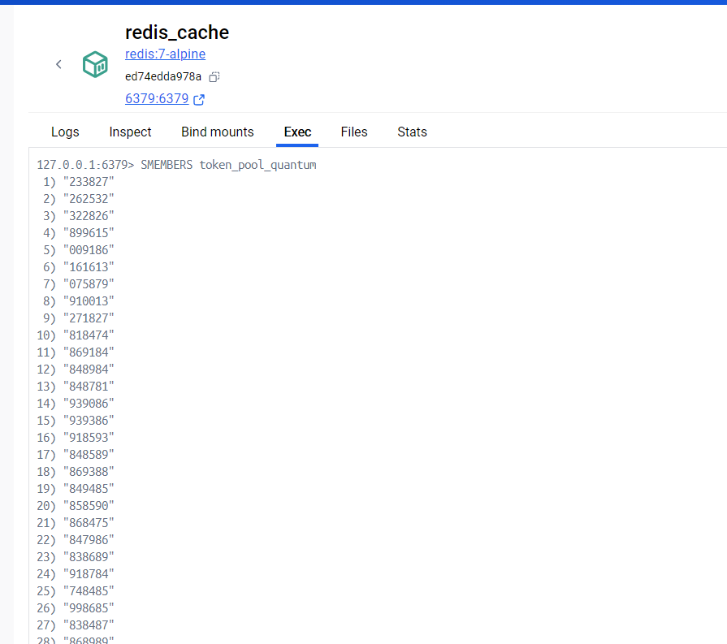
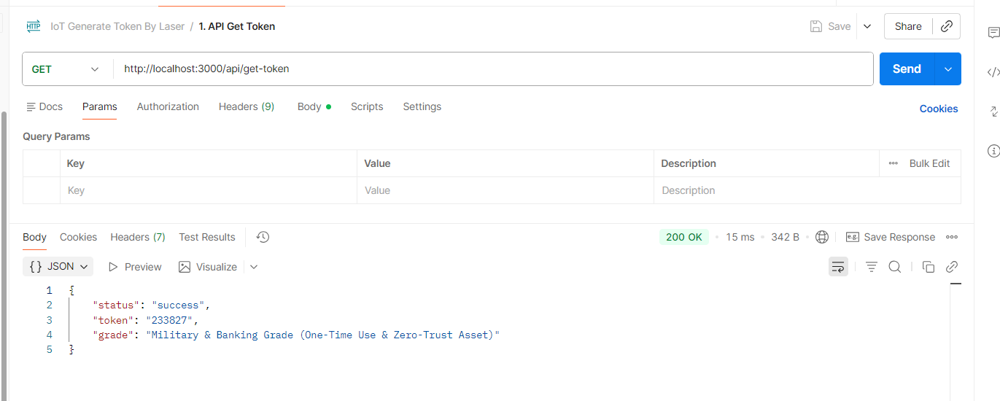

# Quantum Laser Gun Token Generator & OTP System

Welcome to the **Quantum Laser Gun Token Generator & OTP System**! This repository showcases a hardware-software integration that uses the unpredictability of quantum mechanics to generate highly secure, pattern-free cryptographic tokens.

## Table of Contents
- [1. The Story of Quantum Randomness](#1-the-story-of-quantum-randomness)
  - [1.1 Traditional Computers: The Illusion of Randomness](#11-traditional-computers-the-illusion-of-randomness)
  - [1.2 The Quantum Laser Solution](#12-the-quantum-laser-solution)
- [2. System Architecture](#2-system-architecture)
  - [2.1 Architecture Diagram](#21-architecture-diagram)
  - [2.2 How the Data Flows](#22-how-the-data-flows)
- [3. Implementation Evidence](#3-implementation-evidence)
  - [3.1 Evidence 1: Hardware Prototype Setup (6-prototipe.jpg)](#31-evidence-1-hardware-prototype-setup-6-prototipejpg)
  - [3.2 Evidence 2: Laser and Sensor Alignment (7-prototipe-sensor-cahaya-laser.jpg)](#32-evidence-2-laser-and-sensor-alignment-7-prototipe-sensor-cahaya-laserjpg)
  - [3.3 Evidence 3: OLED Token Display (8-prototipe-oled-display-token.jpg)](#33-evidence-3-oled-token-display-8-prototipe-oled-display-tokenjpg)
  - [3.4 Evidence 4: ESP32 Arduino Serial Monitoring (2-ardunio-monitoring-generate-token.png)](#34-evidence-4-esp32-arduino-serial-monitoring-2-ardunio-monitoring-generate-tokenpng)
  - [3.5 Evidence 5: MQTT Message Publication (3-mqtt-pub-token.png)](#35-evidence-5-mqtt-message-publication-3-mqtt-pub-tokenpng)
  - [3.6 Evidence 6: Docker Microservice Deployment Stack (1-docker-deployment-stack-tech.png)](#36-evidence-6-docker-microservice-deployment-stack-1-docker-deployment-stack-techpng)
  - [3.7 Evidence 7: Redis Cache Token Pool (4-redis-pool-token.png)](#37-evidence-7-redis-cache-token-pool-4-redis-pool-tokenpng)
  - [3.8 Evidence 8: Node.js HTTP API Get Token Endpoint (5-node-js-api-get-token.png)](#38-evidence-8-node-js-http-api-get-token-endpoint-5-node-js-api-get-tokenpng)

---

## 1. The Story of Quantum Randomness

### 1.1 Traditional Computers: The Illusion of Randomness
In traditional computing, generating a random number is not actually random. Standard computer algorithms use mathematical formulas to calculate "pseudo-random" numbers. These systems rely on an initial starting value known as a **seed**. 

If an attacker discovers or guesses the seed and the algorithm used, the entire sequence of generated tokens becomes completely predictable. In high-stakes environments, this mathematical predictability is a dangerous vulnerability. If a hacker predicts the next OTP (One-Time Password) or cryptographic salt, they can bypass security checks, compromise banking transactions, or intercept confidential military communications.

### 1.2 The Quantum Laser Solution
This project looks to quantum physics for a solution. In the quantum realm, nature is truly unpredictable. When we shine a laser beam onto a light-dependent resistor (LDR) sensor, we are measuring physical quantum events: the interactions of countless individual packets of light (photons) crashing into the semiconductor material of the sensor.

Because of quantum fluctuations, the intensity of light and electrical resistance fluctuates in a completely random way at any microsecond. There is no mathematical formula or "seed" behind these tiny variations. It is impossible to recreate, reverse-engineer, or predict the next values. 

This absolute lack of patterns makes quantum-generated tokens exceptionally secure. They are ideal for:
- **One-Time Passwords (OTP)**: Completely unguessable login codes.
- **Cryptographic Salts**: Adding true random noise to hash functions for secure data storage.
- **Financial Transactions**: Preventing fraud in digital banking.
- **Military-Grade Cryptography**: Securing high-level classified communication.

---

## 2. System Architecture

### 2.1 Architecture Diagram
Below is the system architecture showing how the hardware and software components communicate:

### 2.2 How the Data Flows
The system is divided into three key layers:
1. **Hardware Layer (ESP32 & Sensors)**:
   - The user triggers a toy laser gun, aiming it at the Light Dependent Resistor (LDR) sensor.
   - The ESP32 microcontroller continuously reads the analog voltage from the sensor. 
   - When the laser light hits the LDR, the resistance drops dramatically. The ESP32 detects this drop and immediately takes 3 rapid analog samples.
   - It extracts the last 2 digits (modulo 100) of each sample and joins them together to form a **6-digit token** (e.g., `124578`).
   - The generated token is displayed locally on a physical OLED Screen, and published wirelessly to the MQTT broker over Wi-Fi on the topic `sensor/laser/token`.
2. **Broker & Queue Layer (MQTT & Worker)**:
   - **Eclipse Mosquitto (MQTT Broker)** acts as the central messaging hub.
   - A Node.js background service (**Cache Worker**) subscribes to the MQTT topic. As soon as it receives a token from the broker, it pushes it into a Redis database Set named `token_pool_quantum`.
3. **Database & API Layer (Redis & Express API)**:
   - **Redis** stores the list of valid, unconsumed quantum tokens in an in-memory Set.
   - A Node.js API server running **Express** exposes a secure GET endpoint `/api/get-token`.
   - When an application requests a token, the API server uses the Redis `SPOP` command. This retrieves one random token from the pool and **instantly deletes it** from Redis. This ensures a true *Zero-Trust* and *One-Time Use* security model.

---

## 3. Implementation Evidence

Here is the step-by-step evidence of the working prototype, showing the physical hardware setup and the software logs.

### 3.1 Evidence 1: Hardware Prototype Setup (6-prototipe.jpg)
This image shows the physical hardware configuration of the project.

- **What it shows**: The prototype consists of an ESP32 microchip, a breadboard, jumper wires, an OLED display module, and an LDR light sensor. A handheld laser pointer is aligned to target the sensor, providing the quantum physical input trigger.

### 3.2 Evidence 2: Laser and Sensor Alignment (7-prototipe-sensor-cahaya-laser.jpg)
This photo shows the laser actively hitting the sensor.

- **What it shows**: The red laser beam is precisely pointed at the LDR light-sensitive resistor. When the laser hits the sensor, it changes the electrical resistance, triggering the ESP32 to immediately begin sampling.

### 3.3 Evidence 3: OLED Token Display (8-prototipe-oled-display-token.jpg)
This close-up photo shows the OLED display status.

- **What it shows**: The small physical screen connected to the ESP32 displays the generated 6-digit token in real-time. It also provides status indicators, showing that the Wi-Fi connection is active and that the token was successfully published (`Pub: Success!`) to the MQTT broker.

### 3.4 Evidence 4: ESP32 Arduino Serial Monitoring (2-ardunio-monitoring-generate-token.png)
This screenshot displays the Arduino IDE Serial Monitor output.

- **What it shows**: Detailed system logs of the ESP32 in action. When the laser is detected (the ADC reading drops below `3500`), the microchip performs three quick analog readings, extracts the last two digits of each, builds the 6-digit token, and successfully publishes it to the broker.

### 3.5 Evidence 5: MQTT Message Publication (3-mqtt-pub-token.png)
This log shows the data passing through the message broker.

- **What it shows**: The raw network transmission showing the token payload being sent to the `sensor/laser/token` topic. This verifies that the microchip is successfully communicating with the Mosquitto MQTT broker across the local network.

### 3.6 Evidence 6: Docker Microservice Deployment Stack (1-docker-deployment-stack-tech.png)
This console output displays the running Docker containers.

- **What it shows**: Four microservices running in isolated containers via Docker Compose: `mqtt_broker` (Mosquitto), `redis_cache` (Redis DB), `cache_worker` (Node.js listener), and `api_server` (Express REST API). This environment structure makes the system easy to deploy and scale.

### 3.7 Evidence 7: Redis Cache Token Pool (4-redis-pool-token.png)
This screenshot displays the Redis CLI command line window.

- **What it shows**: The `token_pool_quantum` Redis Set query. It lists the random 6-digit tokens stored securely in memory, waiting to be consumed by client requests.

### 3.8 Evidence 8: Node.js HTTP API Get Token Endpoint (5-node-js-api-get-token.png)
This image shows the client consuming a token via the HTTP API.

- **What it shows**: A request to `http://localhost:3000/api/get-token` returning a JSON response with status `success` and the retrieved token. The terminal log confirms that once the token is requested, it is immediately deleted from Redis (`SPOP`), ensuring that each token can only be used once.
